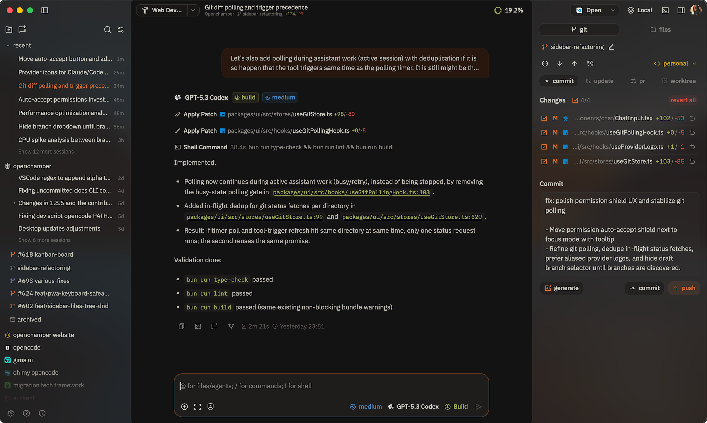

# <picture><source media="(prefers-color-scheme: dark)" srcset="docs/references/badges/openchamber-logo-dark.svg"></picture> OpenChamber

[![GitHub stars](https://img.shields.io/github/stars/btriapitsyn/openchamber?style=flat&logo=data%3Aimage%2Fsvg%2Bxml%3Bbase64%2CPHN2ZyB4bWxucz0iaHR0cDovL3d3dy53My5vcmcvMjAwMC9zdmciIHdpZHRoPSIzMiIgaGVpZ2h0PSIzMiIgZmlsbD0iI2YxZWNlYyIgdmlld0JveD0iMCAwIDI1NiAyNTYiPjxwYXRoIGQ9Ik0yMjkuMDYsMTA4Ljc5bC00OC43LDQyLDE0Ljg4LDYyLjc5YTguNCw4LjQsMCwwLDEtMTIuNTIsOS4xN0wxMjgsMTg5LjA5LDczLjI4LDIyMi43NGE4LjQsOC40LDAsMCwxLTEyLjUyLTkuMTdsMTQuODgtNjIuNzktNDguNy00MkE4LjQ2LDguNDYsMCwwLDEsMzEuNzMsOTRMOTUuNjQsODguOGwyNC42Mi01OS42YTguMzYsOC4zNiwwLDAsMSwxNS40OCwwbDI0LjYyLDU5LjZMMjI0LjI3LDk0QTguNDYsOC40NiwwLDAsMSwyMjkuMDYsMTA4Ljc5WiIgb3BhY2l0eT0iMC4yIj48L3BhdGg%2BPHBhdGggZD0iTTIzOS4xOCw5Ny4yNkExNi4zOCwxNi4zOCwwLDAsMCwyMjQuOTIsODZsLTU5LTQuNzZMMTQzLjE0LDI2LjE1YTE2LjM2LDE2LjM2LDAsMCwwLTMwLjI3LDBMOTAuMTEsODEuMjMsMzEuMDgsODZhMTYuNDYsMTYuNDYsMCwwLDAtOS4zNywyOC44Nmw0NSwzOC44M0w1MywyMTEuNzVhMTYuMzgsMTYuMzgsMCwwLDAsMjQuNSwxNy44MkwxMjgsMTk4LjQ5bDUwLjUzLDMxLjA4QTE2LjQsMTYuNCwwLDAsMCwyMDMsMjExLjc1bC0xMy43Ni01OC4wNyw0NS0zOC44M0ExNi40MywxNi40MywwLDAsMCwyMzkuMTgsOTcuMjZabS0xNS4zNCw1LjQ3LTQ4LjcsNDJhOCw4LDAsMCwwLTIuNTYsNy45MWwxNC44OCw2Mi44YS4zNy4zNywwLDAsMS0uMTcuNDhjLS4xOC4xNC0uMjMuMTEtLjM4LDBsLTU0LjcyLTMzLjY1YTgsOCwwLDAsMC04LjM4LDBMNjkuMDksMjE1Ljk0Yy0uMTUuMDktLjE5LjEyLS4zOCwwYS4zNy4zNywwLDAsMS0uMTctLjQ4bDE0Ljg4LTYyLjhhOCw4LDAsMCwwLTIuNTYtNy45MWwtNDguNy00MmMtLjEyLS4xLS4yMy0uMTktLjEzLS41cy4xOC0uMjcuMzMtLjI5bDYzLjkyLTUuMTZBOCw4LDAsMCwwLDEwMyw5MS44NmwyNC42Mi01OS42MWMuMDgtLjE3LjExLS4yNS4zNS0uMjVzLjI3LjA4LjM1LjI1TDE1Myw5MS44NmE4LDgsMCwwLDAsNi43NSw0LjkybDYzLjkyLDUuMTZjLjE1LDAsLjI0LDAsLjMzLjI5UzIyNCwxMDIuNjMsMjIzLjg0LDEwMi43M1oiPjwvcGF0aD48L3N2Zz4%3D&logoColor=FFFCF0&labelColor=100F0F&color=66800B)](https://github.com/btriapitsyn/openchamber/stargazers)
[](https://github.com/btriapitsyn/openchamber/releases/latest)
[](https://opencode.ai)
[](https://discord.gg/ZYRSdnwwKA)
[](https://ko-fi.com/G2G41SAWNS)

## **OpenCode，随处可用。** 桌面端、浏览器、手机。

### 为 [OpenCode](https://opencode.ai) 打造的丰富界面。查看 diff、管理 agent、运行开发服务器，让你的 AI 编码时仍能把握全局。



<details>
<summary>更多截图</summary>


<p>


</p>

</details>

## 亮点

- **随处可用** - Cloudflare 隧道 + 二维码接入。扫码连接，在沙发上也能写代码。
- **可分支聊天时间线** - 支持撤销、重做，任意轮次一键分叉。探索不同方案而不丢进度。
- **GitHub 原生工作流** - 从 issue 和 PR 启动会话，自动带上上下文。查看 checks、合并，全部在应用内完成。
- **项目操作** - 一键运行开发服务器、配置 SSH 端口转发、本地打开远程 URL。项目命令触手可及。
- **连接远程机器** - 桌面端通过 SSH 连接远程 OpenChamber 实例，提供完整生命周期与 UX 流程。

## 快速开始

> **前置条件：** 已安装 [OpenCode CLI](https://opencode.ai)。

### **桌面端（macOS）**

从 [Releases](https://github.com/btriapitsyn/openchamber/releases) 下载。

### **VS Code**

从 [Marketplace](https://marketplace.visualstudio.com/items?itemName=fedaykindev.openchamber) 安装，或在扩展中搜索
“OpenChamber”。

### **CLI（Web + PWA）**

_需要 Node.js 20+_

```bash
curl -fsSL https://raw.githubusercontent.com/btriapitsyn/openchamber/main/scripts/install.sh | bash
openchamber --ui-password be-creative-here --daemon
```

<details>
<summary>高级 CLI 选项</summary>

```bash
openchamber --port 8080              # 自定义端口
openchamber --daemon                 # 后台模式
openchamber --ui-password secret     # UI 加密保护
openchamber --try-cf-tunnel          # Cloudflare Quick Tunnel
openchamber --try-cf-tunnel --tunnel-qr              # + 二维码
openchamber --try-cf-tunnel --tunnel-password-url     # + URL 中包含密码
openchamber stop                     # 停止服务器
openchamber update                   # 更新到最新
```

连接到已有的 OpenCode 服务器：

```bash
OPENCODE_PORT=4096 OPENCODE_SKIP_START=true openchamber
OPENCODE_HOST=https://myhost:4096 OPENCODE_SKIP_START=true openchamber
```

</details>

<details>
<summary>Docker</summary>

```bash
docker compose up -d
```

访问地址：`http://localhost:3000`。

**UI 密码：**

```yaml
environment:
  UI_PASSWORD: your_secure_password
```

**Cloudflare 隧道：**

```yaml
environment:
  CF_TUNNEL: "true" # 可选：true, qr, password
```

| 值          | 说明               |
|------------|------------------|
| `true`     | 仅启用隧道            |
| `qr`       | 启用隧道 + 二维码       |
| `password` | 启用隧道 + URL 中包含密码 |

**数据目录权限：** `data/` 目录用于持久化存储，运行前先执行：

```bash
mkdir -p data/openchamber data/opencode/share data/opencode/config data/ssh
chown -R 1000:1000 data/
```

**SSH/Git：** 如果 git push/pull 失败，请在终端运行 `ssh -T git@github.com`。

</details>

<details>
<summary>命名 Cloudflare Tunnel（持久主机名）</summary>

如需用 Cloudflare 账号的自定义主机名提供可靠的长期访问：

- 在应用内配置：**Settings > OpenChamber > Tunnel**，切换到 **Named** 模式。
- 需要你的 Cloudflare 账号里有一个域名。
- [Cloudflare 配置指南](https://developers.cloudflare.com/cloudflare-one/networks/connectors/cloudflare-tunnel/get-started/create-remote-tunnel/)
- CLI `--tunnel <config.yml>` 支持即将推出。

</details>

## 功能特性

<details>
<summary><strong>聊天与交互</strong></summary>

- 可分支的聊天时间线，支持 `/undo`、`/redo`，任意轮次一键分叉
- 单次提示多 agent 并行运行，使用隔离 worktree 进行安全对比
- 语音模式：语音输入 + 朗读回复，解放双手
- Plan/Build 模式：专属计划视图用于撰写与迭代步骤
- 在 diff、文件和计划中撰写内联评论草稿，直接反馈给 agent
- 以 `!` 开头的 Shell 模式，输出内联展示
- 消息可分享为图片
- Mermaid 图表内联渲染，支持复制/下载
- 智能工具 UI 覆盖 diff、文件操作、权限和任务进度

</details>

<details>
<summary><strong>Git 与 GitHub</strong></summary>

- 完整 Git 侧边栏，支持暂存、提交、push/pull、分支管理、rebase/merge 流程
- PR 创建支持 AI 生成描述、状态检查与合并操作
- 从 GitHub issue 与 PR 启动会话，自动带入上下文
- 多远端 push 与识别 fork 的 PR 创建
- Worktree 集成：分支隔离会话，冲突处理后合并回主线
- Git 身份、gitmoji 支持、GitHub 多账号认证

</details>

<details>
<summary><strong>文件、Diff 与终端</strong></summary>

- 工作区文件浏览器，支持内联编辑、语法高亮和 Markdown 预览
- 精美 diff 查看器，堆叠/内联模式，大变更集懒加载
- 集成终端，按目录独立会话，标签页界面，大输出依然稳定
- 消息中的文件路径可点击，跳转到精确行号
- 全视图文件类型图标，提升视觉扫描效率

</details>

<details>
<summary><strong>Web / PWA</strong></summary>

- Cloudflare 隧道支持 Quick 与 Named 模式，安全一次性连接链接与二维码接入
- 移动优先：优化聊天控件、键盘安全布局、拖拽排序项目
- 后台通知与跨标签会话追踪
- 自更新 + 重启流程，保留服务器设置
- 可安装为 PWA，并按项目命名

</details>

<details>
<summary><strong>桌面端（macOS）</strong></summary>

- 通过 SSH 连接远程 OpenChamber 实例，提供完整生命周期流程
- 项目操作：运行开发服务器、SSH 端口转发、本地打开远程 URL
- 多窗口支持并行项目工作流
- “Open In” 快捷入口：Finder、Terminal 与你偏好的编辑器
- 本地/远程实例快速切换
- 原生 macOS 菜单、深度链接处理、精致启动体验

</details>

<details>
<summary><strong>VS Code 扩展</strong></summary>

- 编辑器原生体验：从工具输出打开文件，会话与代码并列展示
- Agent Manager：单次提示多模型并行运行
- 右键操作：添加上下文、解释选中内容、就地改进代码
- 会话编辑面板、响应式布局、主题映射到编辑器
- Edit 风格工具结果直接在专注 diff 视图打开

</details>

<details>
<summary><strong>个性化</strong></summary>

- 18+ 内置主题，包含明/暗变体
- 通过 `~/.config/openchamber/themes/` 中的 JSON 文件自定义主题，热重载无需重启
- 可配置聊天、面板与服务的快捷键
- 字号、间距、圆角与布局控制
- 项目图标可上传自定义，并自动发现 favicon
- 技能目录与本地技能管理，便于复用自动化

[阅读指南：自定义主题](docs/CUSTOM_THEMES.md)

</details>

<details>
<summary><strong>上下文与效率</strong></summary>

- Token 使用量、成本拆分与原始消息查看面板
- 跨多提供商的配额跟踪，含速度/预测指标
- 快捷键循环常用模型
- 会话文件夹与子文件夹，支持拖拽排序
- 每个项目持久化备注与待办
- 每个会话草稿持久化，扩展专注模式适配长提示

</details>

## 路线图

项目持续开发中，正在进行或计划中的内容：

- Windows 与 Linux 桌面应用
- 支持远程实例与笔记本联动的移动应用
- 更多内置隧道选项
- 多 agent 看板（保持人类在环并可控）
- 内置 OpenCode 插件/工具目录
- Linear 集成
- 内置浏览器，用于运行开发应用并与 agent 集成

## 致谢

独立项目，与 OpenCode 团队无官方关联。

**特别感谢：**

- [OpenCode](https://opencode.ai) - 出色的 API 与可扩展架构。
- [Flexoki](https://github.com/kepano/flexoki) - 由 [Steph Ango](https://stephango.com/flexoki) 设计的精美配色。
- [Pierre](https://pierrejs-docs.vercel.app/) - 速度快、外观漂亮、带语法高亮的 diff 查看器。
- [Tauri](https://github.com/tauri-apps/tauri) - 桌面应用框架。
- [Ghostty-web](https://github.com/coder/ghostty-web) - 出色的 Ghostty Web 渲染器实现。
- [David Hill](https://x.com/iamdavidhill) -
  激励我不再 [过度思考](https://x.com/iamdavidhill/status/1993648326450020746) 而直接发布。
- [我的妻子](https://github.com/yulia-ivashko) - 零 AI 背景第一次使用就做出了每次成功 push 都会播放的烟花庆祝。
- 每一位贡献者，用 PR、创意与细节打磨塑造了这个项目。

## 参与贡献

开发环境与规范请见 [CONTRIBUTING.md](./CONTRIBUTING.md)。

## 许可证

MIT
